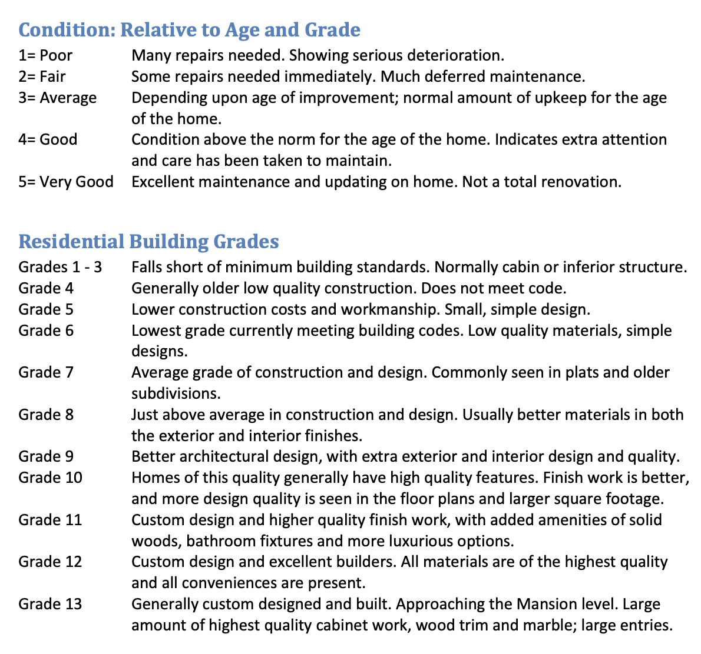
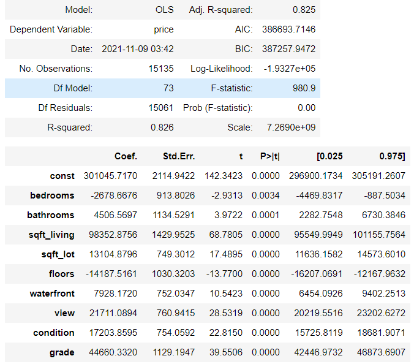

## Project Overview

We are given the dataset to Kings County, Washington housing sales from 2014-2015 to provide homeowners who currently live in Kings County, Washington on price expectations when trying to sell their home.

Our task to build a linear regression model to evaluate the relationship between price and the features given below.

### The Data

* **id** - unique identified for a house
* **date** - house was sold
* **price** -  is prediction target
* **bedroomsNumber** -  of Bedrooms/House
* **bathroomsNumber** -  of bathrooms/bedrooms
* **sqft_living** -  footage of the home
* **sqft_lot** -  footage of the lot
* **floorsTotal** -  floors (levels) in house
* **waterfront** - House which has a view to a waterfront
* **view** - Has been viewed
* **condition** - How good the condition is ( Overall )
* **grade** - overall grade given to the housing unit, based on King County grading system
* **sqft_above** - square footage of house apart from basement
* **sqft_basement** - square footage of the basement
* **yr_built** - Built Year
* **yr_renovated** - Year when house was renovated
* **zipcode** - zip
* **lat** - Latitude coordinate
* **long** - Longitude coordinate
* **sqft_living15** - The square footage of interior housing living space for the nearest 15 neighbors
* **sqft_lot15** - The square footage of the land lots of the nearest 15 neighbors

Our data is narrowed down to these constraints:

- Price range narrowed down to 78,000 to 1,120,000
- Square footage of (370-4230)
- Bedrooms (1-6)
- Bathrooms (.50-4.75)
- Floors (1-3)
- Grade (1-11)

### Final Model

** Full model is in notebook

### Conclusion

After generating several models to understand the relationship between the features and price we have concluded that the most important features in a house is the square footage, grade, and number of views, and condition. 

With 83% variance in our model, we can explain that and as 301,045 our intercept price:
1. Square Foot Living: As one unit of the square footage increases, the price increases by 98,000 dollars
2. Grade: As the building standard moves up 1 grade, the price of the house increases by 45,000 dollars
3. View: If the amount of views goes up by 1, the price of the house increases by 22,000 dollars
4. Condition: As the condition of the house moves up by 1 , the price of the house increases by 17,000 dollars

### Future Work
- Look at a more updated dataset: Our data is only from 2014-2015 so there is no way that this is accurate in current times
- Research on other features like living room square footage: Does the area of the living room have an effect of price as well?
- Look into the relation between house features to location: Does location have an effect of building structure (Suburb vs. City)?
